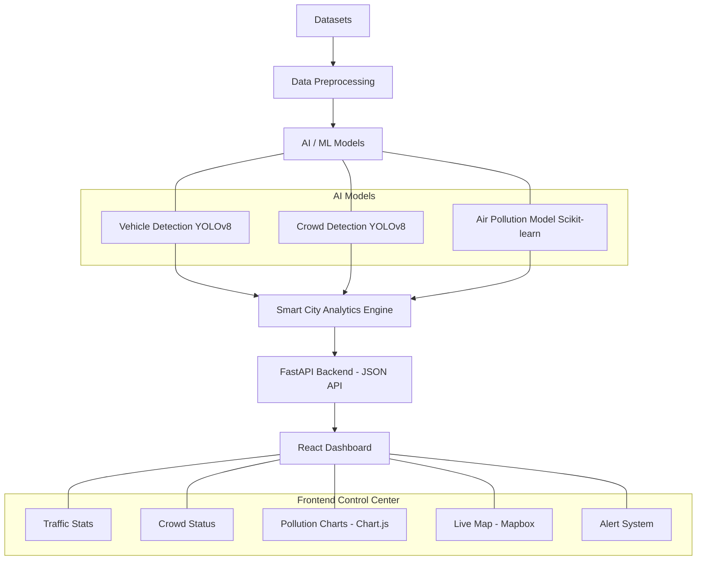

# UrbanEye - Smart City Monitoring System

UrbanEye is an end-to-end AI/ML and Data Science platform that monitors and analyzes city health, including **Traffic Congestion**, **Crowd Density**, and **Air Pollution**. It features a fast Python Backend (FastAPI) running cutting-edge AI models, and a sleek, interactive Smart City Dashboard (React + TailwindCSS).

## Project Architecture


## Features
* **Vehicle Detection System:** Simulated using YOLOv8 logic bounds to count vehicles and estimate traffic density.
* **Crowd Detection System:** Real-time crowd aggregation and density detection.
* **Air Pollution Prediction:** A mock Scikit-learn Random Forest structure returning current AQI and 24h predictions.
* **Smart Alert Engine:** Correlates AI inferences to generate system-wide alerts.
* **Interactive Control Center:** Modern UI built with Vite, React, Tailwind, and Chart.js.

## Tech Stack
* **AI/ML:** Python, YOLOv8, OpenCV, Scikit-learn, Pandas, NumPy
* **Backend:** FastAPI, Uvicorn (Python)
* **Frontend:** React, Vite, TailwindCSS, Chart.js, Mapbox, Lucide React

## Step-by-Step Installation Guide

### Prerequisites
* Python 3.9+
* Node.js 18+

### 1. Backend Setup (FastAPI & AI Models)
1. Open a terminal and navigate to the backend folder:
   ```bash
   cd "backend"
   ```
2. Create and activate a Virtual Environment:
   ```bash
   python -m venv venv
   # On Windows:
   .\venv\Scripts\activate
   # On Mac/Linux:
   source venv/bin/activate
   ```
3. Install dependencies:
   ```bash
   pip install -r requirements.txt
   ```
4. Start the FastAPI Server:
   ```bash
   uvicorn main:app --reload --port 8000
   ```
   *The API will be running at `http://localhost:8000`*

### 2. Frontend Setup (React Dashboard)
1. Open a new terminal and navigate to the frontend folder:
   ```bash
   cd "frontend"
   ```
2. Install npm dependencies:
   ```bash
   npm install
   ```
3. Run the development server:
   ```bash
   npm run dev
   ```
   *The Dashboard will be available at `http://localhost:5173`*

*(Note: Ensure you obtain a valid Mapbox token and update `CityMap.jsx` if maps do not render).*

---
## Project Output
Once running, the dashboard dynamically polls data from `http://localhost:8000`, processes the simulated YOLOv8 and AI data frames, and paints a futuristic picture of your smart city's real-time statistics.
